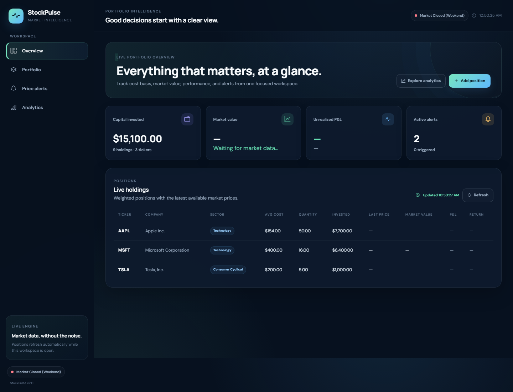
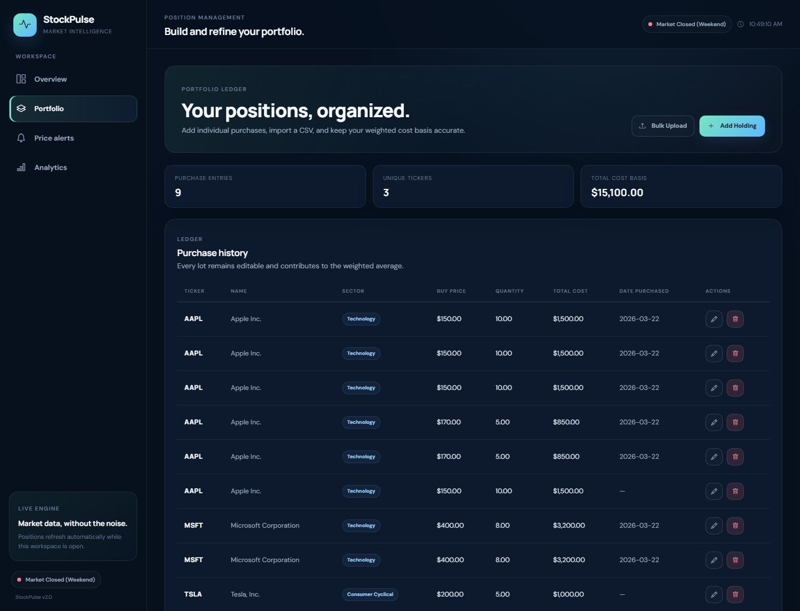
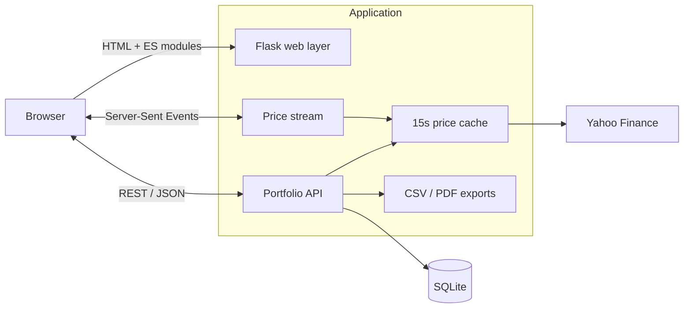

<div align="center">

# StockPulse

**A focused, self-hosted workspace for portfolio monitoring, price alerts, and market analytics.**


</div>

StockPulse combines a lightweight Flask API with a responsive, framework-free frontend. It tracks purchase lots, calculates weighted cost basis, monitors configurable price thresholds, visualizes historical performance, and exports portfolio records—all from a clean local-first interface.

## Product preview

| Portfolio overview | Position management |
| --- | --- |
|  |  |

## What it does

- **Portfolio intelligence** — groups purchase lots by ticker and calculates invested capital, weighted average cost, market value, and unrealized return.
- **Live market data** — retrieves Yahoo Finance prices with a short-lived in-memory cache and degrades cleanly when upstream data is unavailable.
- **Price alerts** — supports stop-loss and take-profit thresholds, in-browser notifications, audio cues, and alert history.
- **Research workspace** — plots historical ticker performance across seven time horizons and visualizes sector allocation with Chart.js.
- **Data portability** — imports holdings from CSV and exports the portfolio as CSV or a formatted PDF report.
- **Responsive UX** — includes accessible navigation, keyboard focus states, reduced-motion support, and layouts for desktop and mobile screens.

## Architecture



The application keeps the deployment footprint intentionally small: Flask serves both UI and API routes, SQLAlchemy owns persistence, and vanilla JavaScript hydrates each page. See [docs/architecture.md](docs/architecture.md) for request flows, component responsibilities, and extension points.

## Technology

| Layer | Choice | Role |
| --- | --- | --- |
| Backend | Python, Flask | Page routing, REST endpoints, SSE, exports |
| Persistence | SQLAlchemy, SQLite | Holdings and alert storage |
| Market data | yfinance | Live quotes, company metadata, history |
| Frontend | Jinja, vanilla JavaScript, Bootstrap | Responsive UI and client-side behavior |
| Visualization | Chart.js | Price history and sector allocation |
| Reporting | fpdf2 | Downloadable PDF reports |
| Tests | pytest | API and regression coverage |

## Quick start

### Windows

Clone the repository, then run:

```powershell
git clone https://github.com/Aman10n/StockPulse.git
cd StockPulse
./start_app.bat
```

The launcher creates a virtual environment, installs dependencies, starts Flask, and opens `http://127.0.0.1:5000`.

### Manual setup

```bash
python -m venv venv

# Windows
venv\Scripts\activate

# macOS / Linux
source venv/bin/activate

pip install -r requirements.txt
python app.py
```

Copy `.env.example` to `.env` to override local defaults:

```dotenv
FLASK_DEBUG=false
PORT=5000
DATABASE_URL=sqlite:///portfolio.db
PRICE_CACHE_TTL=15
```

## CSV import format

The importer accepts UTF-8 CSV files up to 2 MB. `ticker`, `buy_price`, and `quantity` are required.

```csv
ticker,name,buy_price,quantity,date_purchased,sector
AAPL,Apple Inc.,172.50,10,2026-01-15,Technology
MSFT,Microsoft Corporation,405.25,5,2026-02-10,Technology
```

## API overview

| Method | Endpoint | Purpose |
| --- | --- | --- |
| `GET` | `/api/health` | Service health and version |
| `GET / POST` | `/api/holdings` | List or create purchase lots |
| `PUT / DELETE` | `/api/holdings/:id` | Update or remove a lot |
| `POST` | `/api/holdings/bulk` | Import lots from CSV |
| `GET` | `/api/portfolio/summary` | Aggregated positions and live values |
| `GET / POST` | `/api/alerts` | List or create price alerts |
| `GET` | `/api/alerts/check` | Evaluate active alerts |
| `GET` | `/api/history/:ticker` | Historical OHLCV series |
| `GET` | `/api/stream` | Server-Sent Event price stream |
| `GET` | `/api/export/csv` | Download portfolio CSV |
| `GET` | `/api/export/pdf` | Download portfolio PDF |

## Testing

```bash
pip install -r requirements-dev.txt
pytest -q
```

Tests use an isolated SQLite database and mock external price requests, so the suite is deterministic and does not require market access.

## Project structure

```text
StockPulse/
├── app.py                 # Flask pages, APIs, market data, exports
├── models.py              # SQLAlchemy models and database setup
├── templates/             # Jinja page templates
├── static/
│   ├── css/style.css      # Responsive design system
│   ├── js/                # Page-level client behavior
│   └── audio/             # Alert sound
├── docs/
│   ├── architecture.md    # Detailed system design
│   └── screenshots/       # Verified product screenshots
├── test_api.py            # API regression suite
└── requirements*.txt      # Runtime and development dependencies
```

## Operational notes

- Market prices depend on Yahoo Finance availability and may be delayed or unavailable outside normal conditions.
- Market-status calculation is timezone-aware for US Eastern Time but does not yet include the exchange holiday calendar.
- The included Flask server is intended for local development. Use a production WSGI server and a managed database for public deployments.
- StockPulse is an information tool, not financial advice or an order-execution platform.

## Contributing

Focused contributions are welcome. Read [CONTRIBUTING.md](CONTRIBUTING.md) for the local workflow and pull-request checklist.
