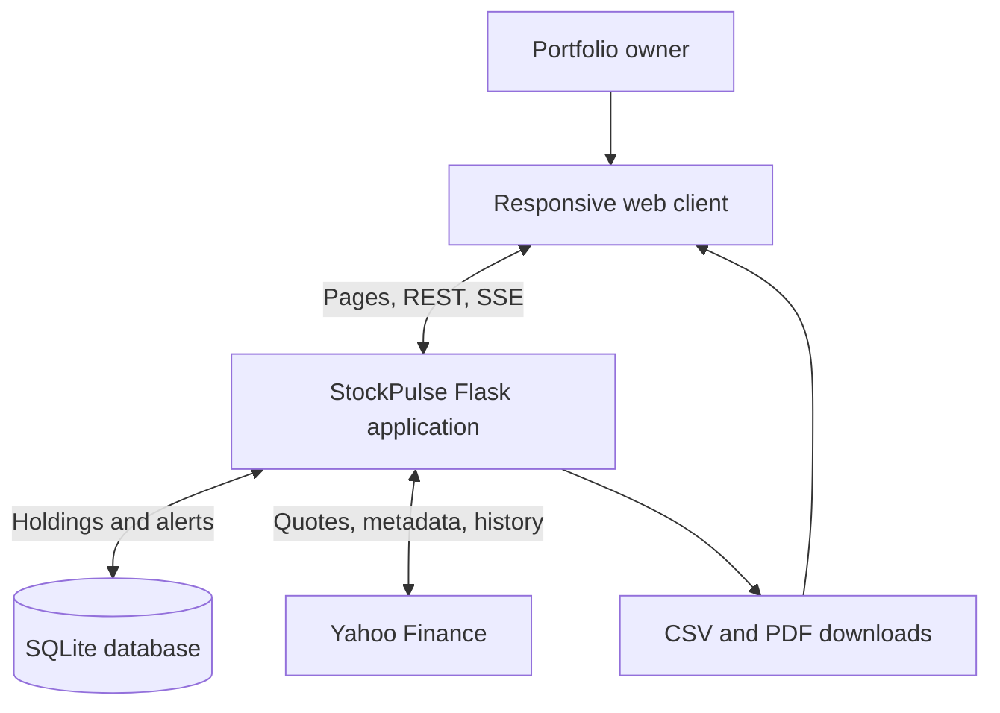
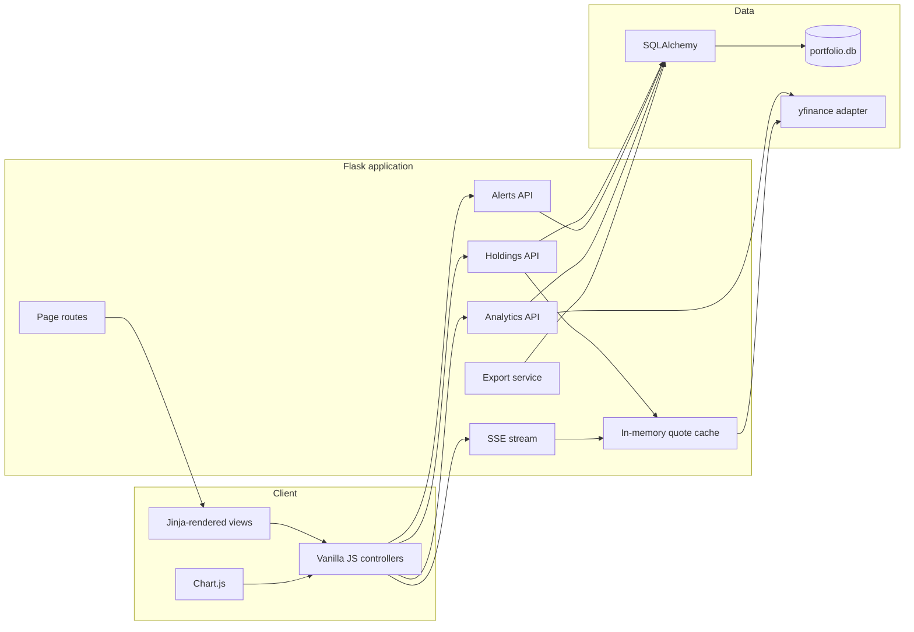
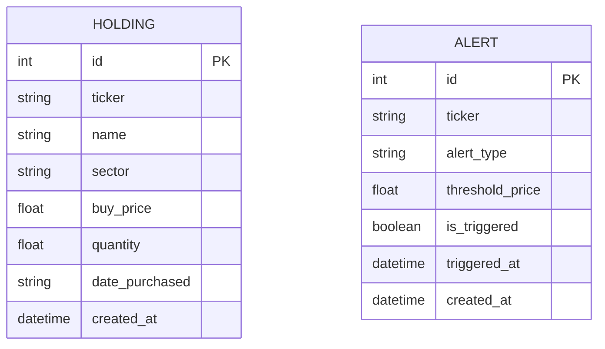

# StockPulse architecture

StockPulse uses a compact monolithic architecture designed for straightforward local deployment. The browser, API, persistence, live-price adapter, and export pipeline remain cleanly separated by responsibility without requiring multiple services.

## System context

## Application components

## Key request flows

### Portfolio overview

1. The dashboard requests `GET /api/portfolio/summary`.
2. SQLAlchemy loads all purchase lots and groups them by ticker.
3. The service calculates quantity, total cost, and weighted average cost.
4. The quote adapter returns cached prices or requests missing quotes from Yahoo Finance.
5. The API derives market value and unrealized P&L where a quote is available.
6. The browser renders summary metrics and the consolidated holdings table.

### Price alert evaluation

1. The browser requests `GET /api/alerts/check` every 60 seconds while the alert page is open.
2. The service loads active rules and requests one quote per unique ticker.
3. Stop-loss rules trigger at or below the threshold; take-profit rules trigger at or above it.
4. Trigger timestamps are committed to SQLite.
5. The browser displays a toast and can issue an OS notification after permission is granted.

### Live price stream

The `/api/stream` endpoint uses Server-Sent Events. It reads distinct portfolio tickers, resolves cached or fresh prices, and emits a JSON event every 30 seconds. SSE keeps the transport unidirectional and lightweight for this read-heavy workload.

## Data model

Holdings intentionally represent purchase lots rather than consolidated positions. Aggregation happens at query time, preserving purchase history and making weighted-average calculations transparent.

## Reliability and security boundaries

- Positive-number validation protects price, quantity, and threshold inputs.
- Uploads are limited to 2 MB and restricted to CSV at the route boundary.
- A 15-second quote cache reduces upstream requests and rate-limit pressure.
- Upstream quote failures degrade to unavailable values instead of breaking portfolio access.
- Database sessions close in `finally` blocks.
- Responses include `nosniff`, same-origin framing, and strict referrer headers.
- Runtime data, environment files, logs, and local databases are excluded from Git.

## Extension points

- Replace SQLite by setting `DATABASE_URL` to another SQLAlchemy-compatible database.
- Move quote retrieval behind a provider interface to add paid or exchange-specific feeds.
- Run alert evaluation in a scheduler or queue for monitoring that continues when no browser is open.
- Add authentication before exposing the application outside a trusted environment.
- Introduce Alembic migrations when the data model begins evolving across deployments.
